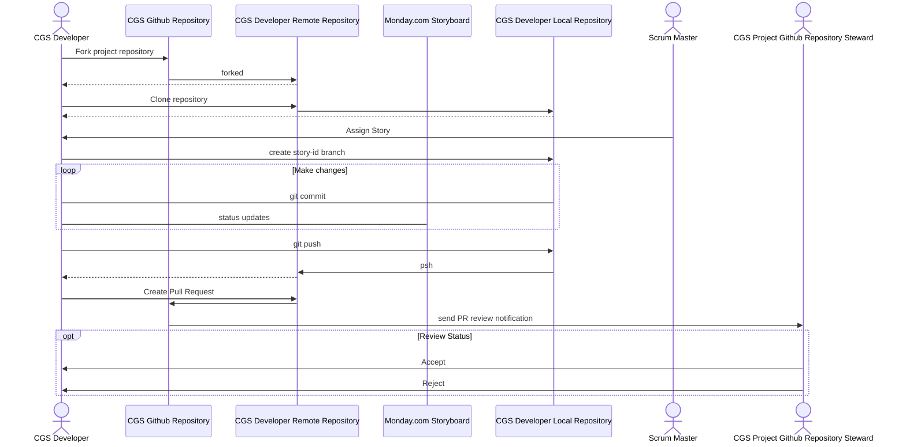

# cgs-dev-guidelines
CGS Development Guidelines

## Github Developer Workflow

```mermaid
sequenceDiagram
  actor dev as CGS Developer
  participant ghr as CGS Github Repository 
  participant fghr as CGS Developer Remote Repository 
  participant mon as Monday.com Storyboard
  participant lw as CGS Developer Local Repository
  actor sm as Scrum Master
  actor reviewer as CGS Project Github Repository Steward
  dev->>ghr: Fork project repository
  ghr->>fghr: forked
  fghr-->>dev: 
  dev->>fghr: Clone repository
  fghr->>lw: 
  lw-->>dev: 
  sm->>dev: Assign Story
  dev->>lw: create story-id branch
  loop Make changes
     dev->lw: git commit
     dev->mon: status updates
  end
  dev->>lw: git push
  lw->>fghr: psh
  fghr-->>dev: 
  dev->>fghr: Create Pull Request
  fghr->>ghr: 
  ghr->>reviewer: send PR review notification
  opt Review Status
    reviewer->>dev: Accept
    reviewer->>dev: Reject
  end
```

